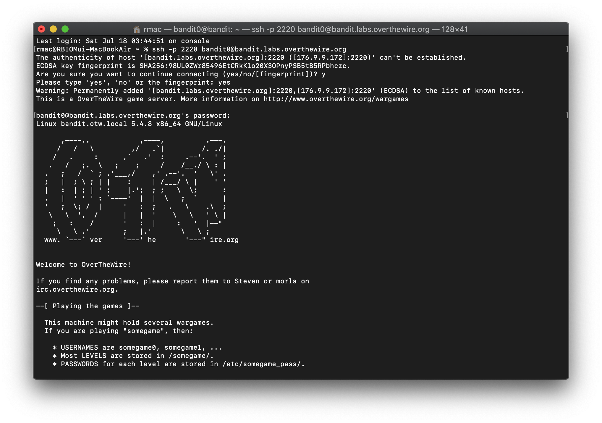

**Level 0**

ssh의 옵션 -p를 2220으로 주어서 포트를 설정한다.

문제에서 주어진 비밀번호를 입력하면 접속할 수 있다.

**Level 1**

홈 디렉토리 내부에 있는 readme 파일에 bandit1에 접속할 수 있는 비밀번호가 있다고 한다.

ls로 디렉토리 목록을 확인해보니 readme 파일이 있는 것을 볼 수 있다.

cat으로 열어보니 문자열이 나왔고 이를 복사해두었다.

현재 bandit에 접속해있으니 logout한 후, Level 0에서 했던 것처럼 bandit1에 접속한다.

비밀번호는 붙여넣기 한다.

**Level 2**

홈 디렉토리 내부에 있는 - 라는 파일에 비밀번호가 있다고 한다.

처음에는 Level 1에서와 같이 ls하고 cat - 를 해서 파일을 열려고 하였다.

그러나 - 문자가 옵션으로 인식하여 진행이 되지 않았다.

그래서 작업을 중지(^Z)하고 파일 이름이 아닌 홈 디렉토리(~/)를 이용하여 비밀번호를 찾아냈다.

그러나 중지된 작업이 존재해서 logout이 되지 않았다.

fg로 중지된 작업으로 돌아가서 작업을 끝냈다(^D).

찾아보니 ^Z는 작업을 중지하는 것이 아닌 백그라운드로 보내는 것이었고 ^D는 프로세스 정상종료 커맨드였다.

상대 경로(./)를 이용한 풀이도 가능하다.

**Level 3**

위와 같은 유형으로 이번엔 파일 이름에 특수문자가 아닌 공백이 있다.

공백은 파일 이름을 쌍따옴표(")로 묶어주면 된다.

