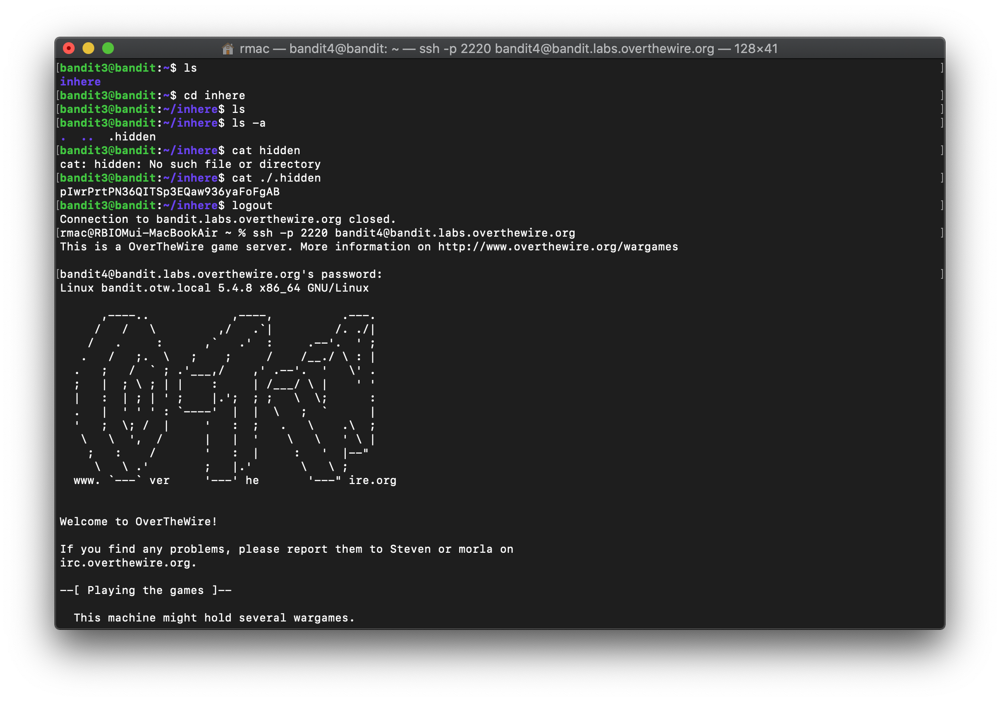
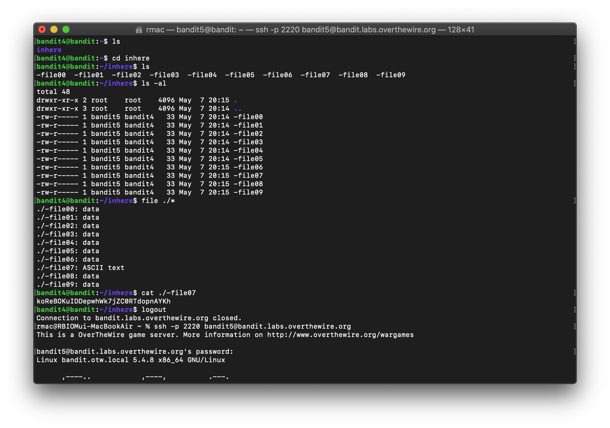
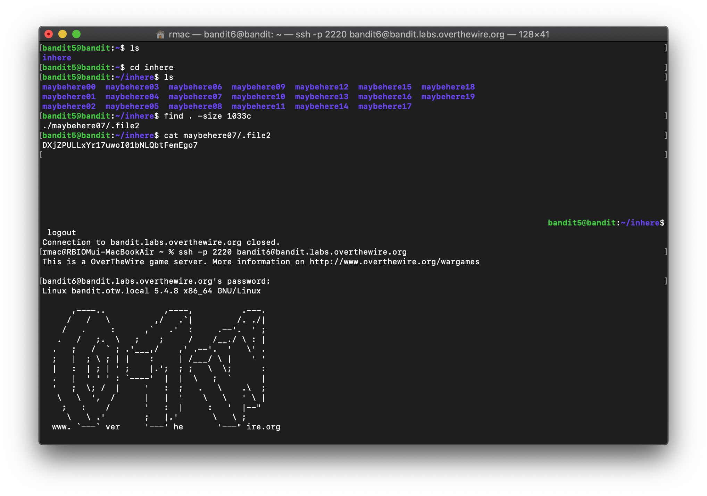
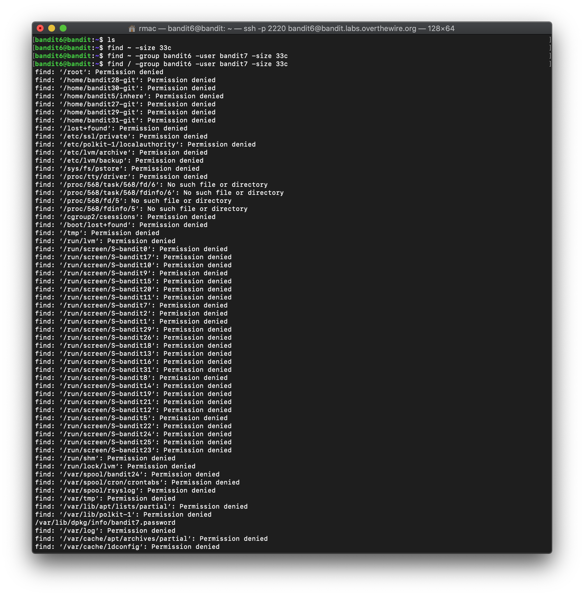
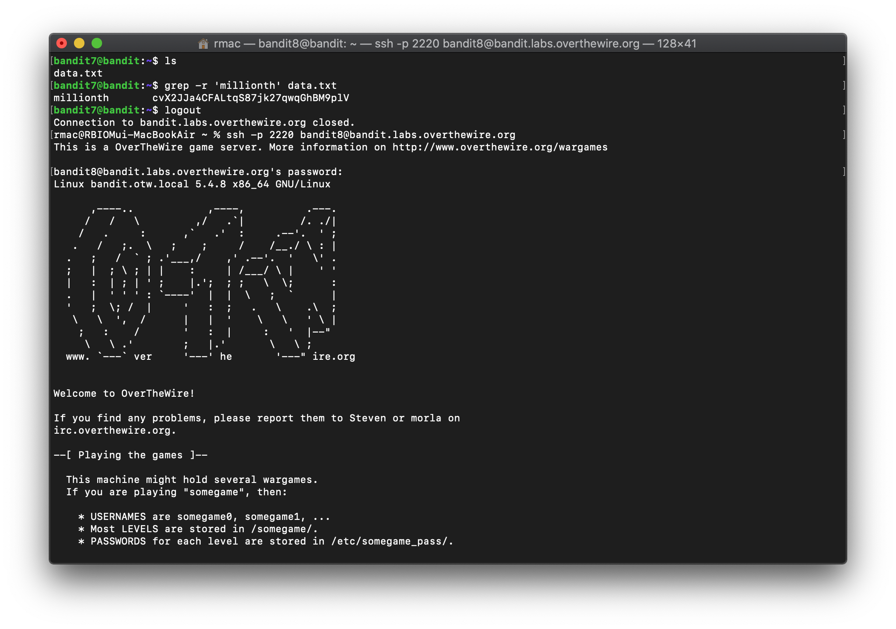
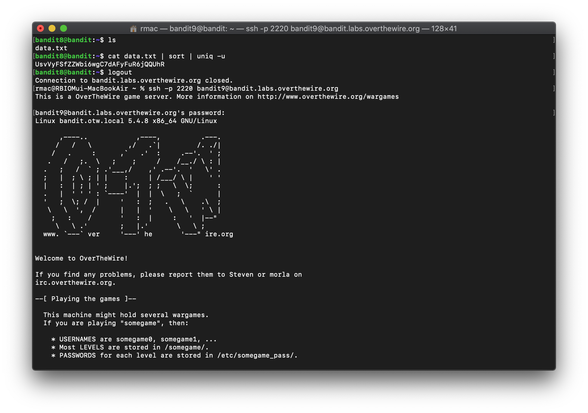

**Level 0**

ssh의 옵션 -p를 2220으로 주어서 포트를 설정한다.

문제에서 주어진 비밀번호를 입력하면 접속할 수 있다.

**Level 1**

홈 디렉토리 내부에 있는 readme 파일에 bandit1에 접속할 수 있는 비밀번호가 있다고 한다.

ls로 디렉토리 목록을 확인해보니 readme 파일이 있는 것을 볼 수 있다.

cat으로 열어보니 문자열이 나왔고 이를 복사해두었다.

현재 bandit에 접속해있으니 logout한 후, Level 0에서 했던 것처럼 bandit1에 접속한다.

비밀번호는 붙여넣기 한다.

**Level 2**

홈 디렉토리 내부에 있는 - 라는 파일에 비밀번호가 있다고 한다.

처음에는 Level 1에서와 같이 ls하고 cat - 를 해서 파일을 열려고 하였다.

그러나 - 문자가 옵션으로 인식하여 진행이 되지 않았다.

그래서 작업을 중지(^Z)하고 파일 이름이 아닌 홈 디렉토리(~/)를 이용하여 비밀번호를 찾아냈다.

그러나 중지된 작업이 존재해서 logout이 되지 않았다.

fg로 중지된 작업으로 돌아가서 작업을 끝냈다(^D).

찾아보니 ^Z는 작업을 중지하는 것이 아닌 백그라운드로 보내는 것이었고 ^D는 프로세스 정상종료 커맨드였다.

상대 경로(./)를 이용한 풀이도 가능하다.

**Level 3**

위와 같은 유형으로 이번엔 파일 이름에 특수문자가 아닌 공백이 있다.

공백은 파일 이름을 쌍따옴표(")로 묶어주면 된다.

**Level 4**

이번엔 숨김 파일을 찾는 방법이다.

숨김 파일은 ls의 옵션 -a를 주면 된다.

**Level 5**

inhere 디렉토리에서 ls를 했더니 파일이 전부 48개였다.

사진에는 나와있지 않지만 file00을 열어봤는데 깨져있길래 파일 형식을 출력해주는 명령어인 file을 사용해서 모든 파일의 형식을 출력했다.

그랬더니 file07만 아스키 텍스트였으므로 이를 cat 하여 비밀번호를 알아냈다.

**Level 6**

inhere에서 ls를 하니, 많은 디렉토리가 나왔다.

1033 bytes의 파일 크기를 갖는 파일을 찾아야하니 그냥 inhere에서 find를 돌렸다.

find .(현재 디렉토리) -size(파일을 크기로 찾는 옵션) 1033c(c는 bytes)

1033bytes를 갖는 파일이 여러개 나오지 않아서 다행이다.

**Level 7**

이번엔 그룹과 유저 그리고 파일 크기가 주어졌다.

디렉토리가 아무것도 없어서 처음에 헤맸지만 그냥 /로 전체 검색을 돌렸다.

파일 1개가 찾아졌기에 이를 cat하여 비밀번호를 알아내었다.

**Level 8**

파일의 내부 문자열 탐색이다.

grep을 사용하여 data.txt 문자열을 탐색해서 비밀번호를 찾아내었다.

**Level 9**

sort와 uniq를 사용하는 예제이다.

sort와 uniq를 찾아보면서 파이프(|)라는 것을 알았다.

cat을 하여 data.txt를 열고 sort를 한 후에(uniq는 정렬된 파일에만 유효하다.) uniq의 옵션인 -u(중복된 행이 없는 항목만 출력)을 사용한다.

